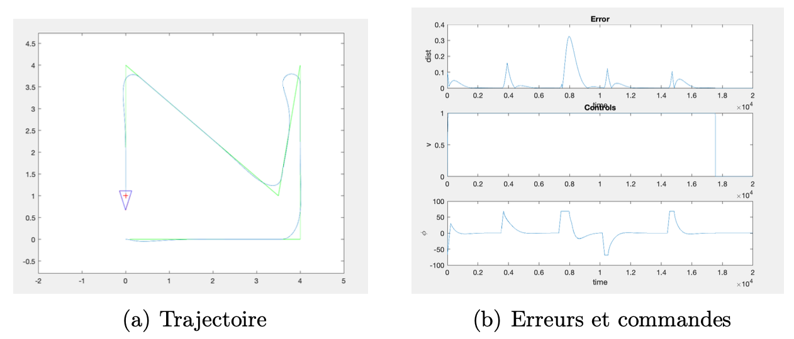
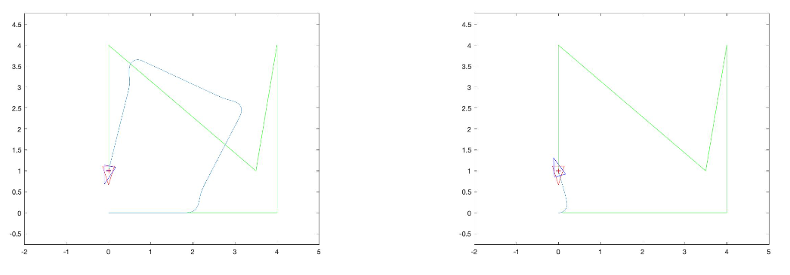
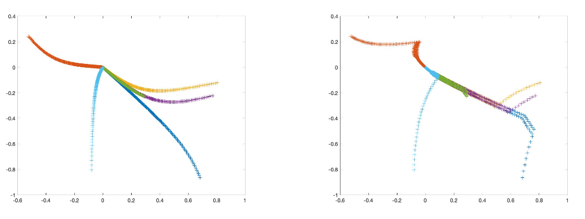
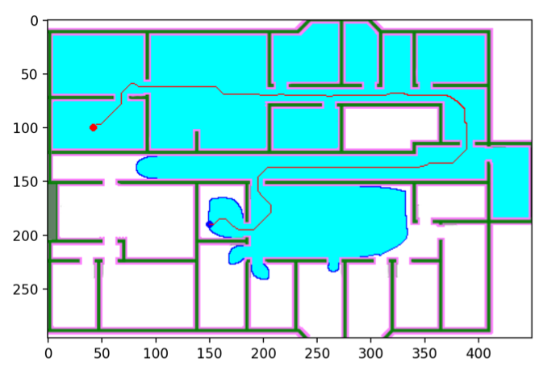
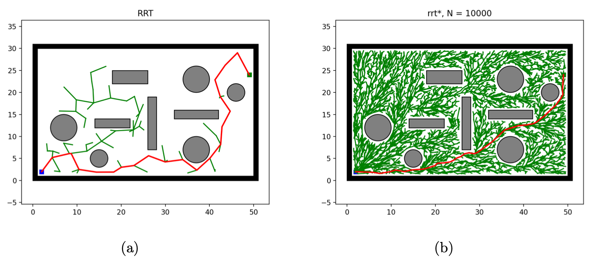
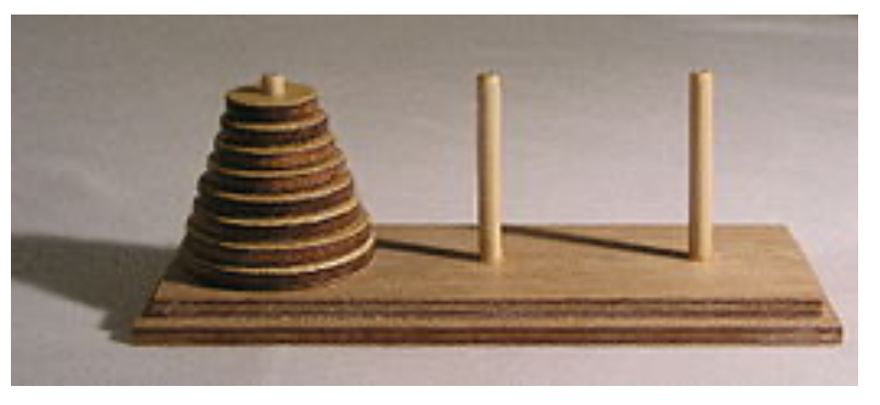

# Planification and control of robot

*Prof : Julien Alexandre dit Sandretto & David FILLIAT & Philippe Morignot*

## Introduction

This is a course (ROB316) project of ENSTA Paris robotics with four parts. 

### 1. PID

*Author : Yan CHEN & Icare SAKR*

In this part, simple PID-based control methods for controlling unicycle and bicycle robots are implemented. The programs provided allow you to simulate robots moving on the plane following unicycle and bicycle models by exploiting a control.

### 2. MPC

*Author : Yan CHEN & Icare SAKR*

In this part, the effect of a feedforward control and a predictive control in a simplified version is discussed.

### 3. Astar

*Author : Yan CHEN*

In this part, the A* path planning algorithm is implemented. The provided script *pathfind.py* makes it possible to read a map from an image file and plan a path between two points.

### 4. RRT

*Author : Yan CHEN*

In this part, the Rapidly Exploring Random Trees (RRT) [1] and variant RRT* algorithm [2] is implemented on different environments. This code is modified from the code of the repository of [Huiming Zhou](https://github.com/zhm-real/PathPlanning) that implements and illustrates many path planing algorithms.

### 5. Action Planicifation

*Author : Yan CHEN*

The CPT version 2 action planner is used to solve all the problems in the part. 

Tower of Hanoi

| Nombre of disk | Length of plan_solution | Search time / s | iteration |
| -------------- | ----------------------- | --------------- | --------- |
| 1              | 2                       | 0.02            | 1         |
| 2              | 6                       | 0.02            | 1         |
| 3              | 14                      | 0.02            | 5         |
| 4              | 30                      | 1.57            | 17        |
| 5              | NoN                     | NoN             | NoN       |

## Reference

[1] Steven M. Lavalle, James J. Kuffner, and Jr. Rapidly-Exploring Random Trees : Progress and Pros- pects. In *Algorithmic and Computational Robotics : New Directions*, pages 293–308, 2000.

[2] Sertac Karaman and Emilio Frazzoli. Sampling-based algorithms for optimal motion planning. *Int. J. Rob. Res.*, 30(7) :846–894, June 2011.

